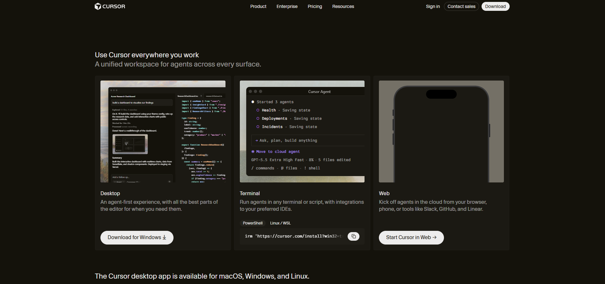
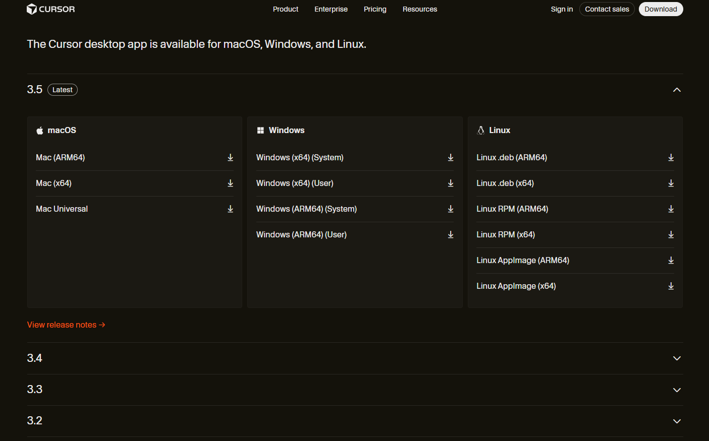

# How to Install Cursor IDE and Extensions

This document outlines the step-by-step process of installing Cursor IDE
and setting up the required extensions as part of the 100Hires portfolio setup.

---

## Prerequisites
- A computer running Windows, macOS, or Linux
- Stable internet connection
- A valid email address for account registration

---

## Part 1 — Installing Cursor IDE

### Step 1 — Download Cursor
Open your browser and go to [https://cursor.com](https://cursor.com),
then click the **"Download"** button.

---

### Step 2 — Choose Your Operating System
Select the correct installer for your system:
- **Windows** — `.exe` file
- **macOS** — `.dmg` file
- **Linux** — `.AppImage` file

---

### Step 3 — Run the Installer
- **Windows:** Double-click the `.exe` file and follow the installation wizard
- **macOS:** Open the `.dmg` file, drag Cursor to the Applications folder
- **Linux:** Make the file executable and run it

> 💡 Tip: Keep all default settings during installation unless you have
> a specific reason to change them.

---

### Step 4 — Launch Cursor
Once installed, open Cursor from your desktop or applications menu.
On first launch, Cursor may ask you to sign in or create an account.

---

## Part 2 — Installing Extensions

### Step 1 — Open the Extensions Panel
In Cursor, open the Extensions panel using one of these methods:
- Click the **Extensions icon** on the left sidebar
- Press `Ctrl + Shift + X` (Windows/Linux) or `Cmd + Shift + X` (macOS)

---

### Step 2 — Install Claude Code
1. In the search bar, type **"Claude Code"**
2. Find the extension by Anthropic
3. Click **"Install"**
4. Once installed, click **"Sign in"** and log in with your Anthropic account

---

### Step 3 — Install Codex
1. In the search bar, type **"Codex"**
2. Find the extension by Openai
3. Click **"Install"**
4. Once installed, click **"Sign in"** and complete the login process

---

### Step 4 — Verify Both Extensions Are Active
After installation, both extensions should appear in your Extensions panel
with a status of **"Enabled"**.

## Result
Successfully installed Cursor IDE with both Claude Code and Codex extensions
active and logged in.

---

*Part of the 100Hires Portfolio Project — [Back to Main README](README.md)*