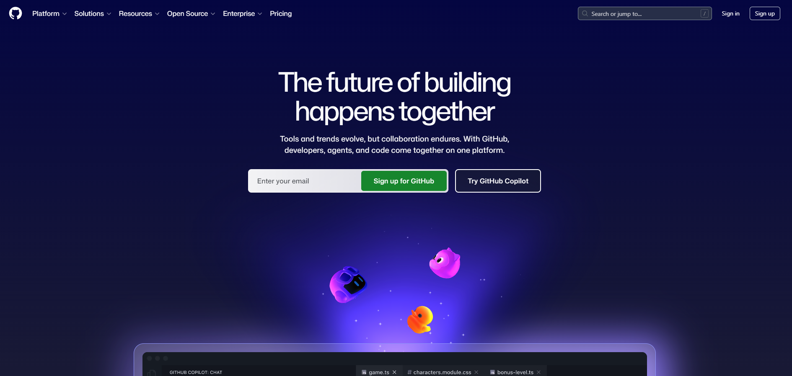
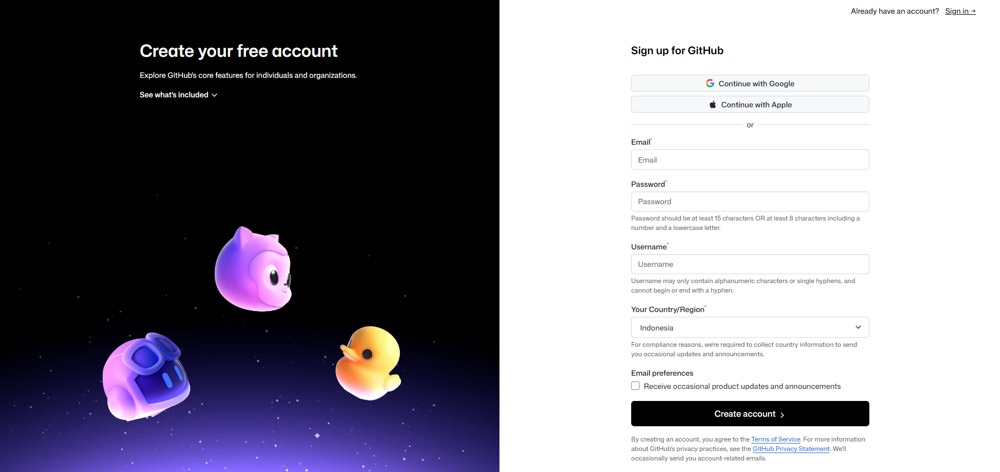
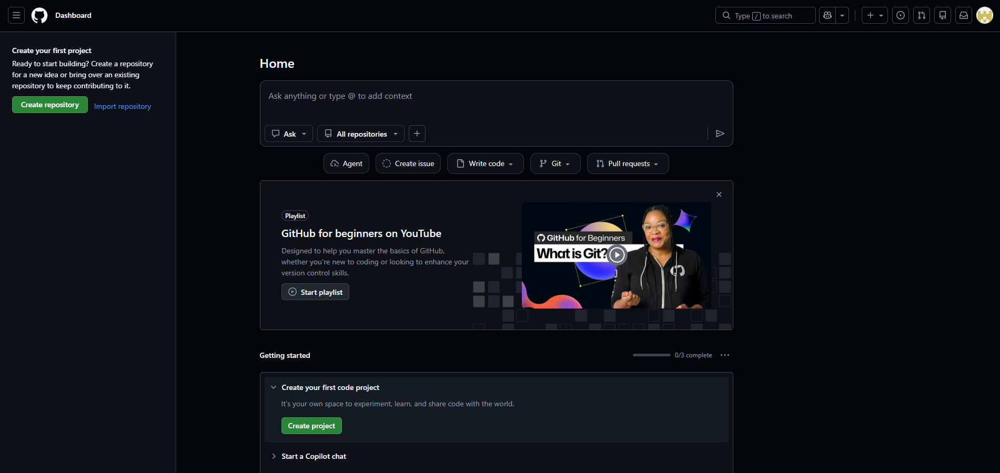

# How to Create a GitHub Account

This document outlines the step-by-step process of creating a GitHub account
as part of the 100Hires portfolio setup.

---

## Prerequisites
- A valid email address
- A web browser (Chrome, Firefox, Edge, etc.)

---

## Steps

### Step 1 — Go to GitHub
Open your browser and navigate to [https://github.com](https://github.com),
then click the **"Sign up"** button in the top right corner.

---

### Step 2 — Enter Your Details
Fill in the registration form:
- **Email address** — use an active email you have access to
- **Password** — minimum 8 characters, include a number or symbol
- **Username** — create a username (e.g., `anggilenovo7-del`)

---

### Step 3 — Solve the Puzzle Verification
GitHub will show a short puzzle to verify you are not a robot.
Complete it to proceed.

---

### Step 4 — Verify Your Email
GitHub will send a verification email to the address you provided.
- Open your inbox
- Click the **"Verify email address"** button in the email

> ⚠️ If you don't see the email, check your **Spam** or **Junk** folder.

---

### Step 5 — Complete Onboarding (Optional)
GitHub may ask a few questions about your experience and goals.
You can answer them or skip by clicking **"Skip personalization"**.

---

### Step 6 — Account Ready
You will be redirected to your GitHub dashboard.
Your account is now active and ready to use.

## Result
Successfully created a GitHub account with username `[your-username]`
and verified the email address.

---

*Part of the 100Hires Portfolio Project — [Back to Main README](README.md)*