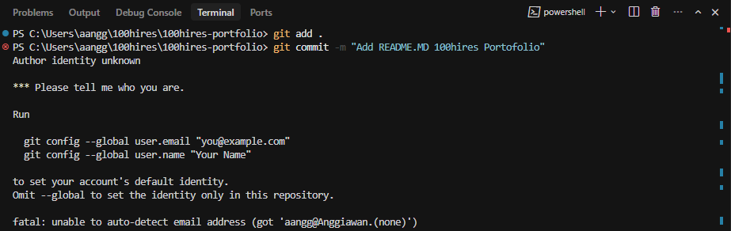
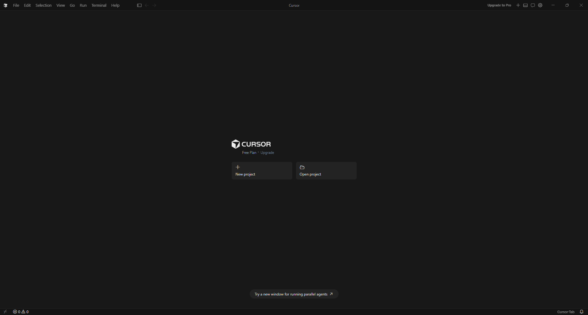
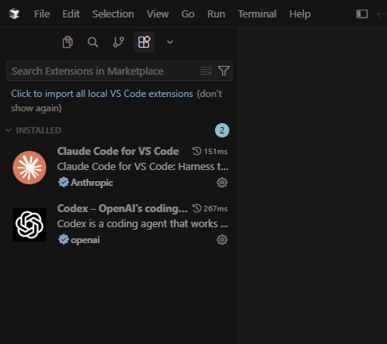
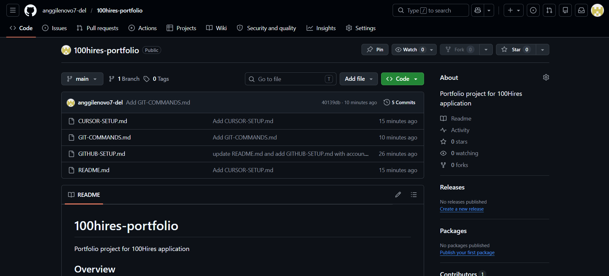
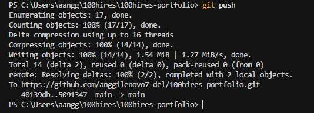

# 100hires-portfolio
Portfolio project for 100Hires application
<!-- 
## Overview
This repository documents the setup process completed as part of the 
100Hires application process. It covers tool installation, environment 
configuration, and reflections on the experience.

---

## Tools Installed

| Tool | Purpose |
|------|---------|
| [Cursor IDE](https://cursor.com) | AI-powered code editor |
| Claude Code *(Cursor Extension)* | AI coding assistant by Anthropic |
| Codex *(Cursor Extension)* | AI code completion tool by Openai |

---

## Steps Completed

1. **Created a GitHub account** — [View detailed steps](GITHUB-SETUP.md)
2. **Installed Cursor IDE and extensions** — [View detailed steps](CURSOR-SETUP.md)
4. **Learned and used Git commands** — [View reference](GIT-COMMANDS.md)
5. **Created this public repository** and cloned it locally
6. **Wrote and committed this README.md**

---

## Challenges & How I Solved Them

**Challenge 1: Rusty knowledge of Git commands**
I had used Git before, but due to a long gap in practice, I had forgotten
most of the workflow. I refreshed my knowledge by searching through
developer documentation websites and consulting an AI assistant to clarify
each step. After that, the `git add`, `git commit`, and `git push` commands
came back to me quickly.

**Challenge 2: Finding the correct extensions in Cursor**
The search results showed multiple similar extensions. I resolved 
this by following the exact names provided in the instructions.

**Challenge 3: Author identity unknown when running git commit**
When running `git commit` for the first time, Git returned a fatal error
stating it could not detect my identity. The terminal showed:
`fatal: unable to auto-detect email address`



I solved this by configuring my Git identity using the following commands:
```bash
git config --global user.email "anggilenovo7@gmail.com"
git config --global user.name "Anggiawan"
```

After running both commands, the commit and push completed successfully.

---

## Screenshots

### Cursor IDE


### Extensions Installed (Claude Code & Codex)


### GitHub Repository


### Git Push Success


---

## Reflection
This process pushed me to learn by doing rather than waiting for 
instructions. I now have a basic understanding of Git, GitHub, and 
AI-powered development tools — and I'm ready for the next step.

---

*Submitted as part of the 100Hires application process.* -->

## Research Overview

**Topic:** LinkedIn Organic Content Strategy for B2B SaaS

### Why I Chose This Topic

LinkedIn is one of the highest-ROI organic channels for B2B SaaS companies. Unlike paid advertising, organic content compounds over time by building trust, credibility, and audience relationships. I chose this topic to better understand what separates high-performing LinkedIn content from generic content and how leading B2B practitioners consistently create demand through organic channels.

### Expert Selection Criteria

I selected experts using three criteria:

1. **Active Practitioners** — They actively use LinkedIn and content marketing to grow their businesses rather than teaching theory alone.
2. **Proven Results** — They have demonstrated measurable success through audience growth, revenue generation, company building, or influence within the B2B SaaS ecosystem.
3. **Diverse Perspectives** — The group covers multiple disciplines including content strategy, positioning, demand generation, product-led growth, audience research, founder-led marketing, and AI-native go-to-market strategies.

### Research Process

To conduct this research, I:

* Identified 10 high-signal B2B SaaS experts
* Collected and analyzed recent LinkedIn posts
* Gathered YouTube content and transcripts where available
* Organized research materials by expert and content type
* Summarized key insights, recurring themes, and strategic patterns
* Used AI tools to accelerate collection, organization, and synthesis of information

### What Was Collected

* 10 expert profiles with annotations → `/research/sources.md`
* 30 LinkedIn posts (3 per expert) → `/research/linkedin-posts/`
* YouTube transcripts and video analysis from selected experts → `/research/youtube-transcripts/`

### Key Observations

Several themes appeared consistently across experts:

* AI is becoming a force multiplier, not a replacement for strategy.
* Strong positioning remains a critical competitive advantage.
* Customer understanding is the foundation of effective content.
* Distribution and audience attention matter more than content volume.
* Human judgment, creativity, and expertise become more valuable as AI-generated content increases.

### Repository Structure

```text
research/
├── sources.md
├── linkedin-posts/
└── youtube-transcripts/
```

This repository serves as a research foundation for understanding how leading B2B SaaS practitioners use content, positioning, audience insights, and AI tools to drive organic growth.